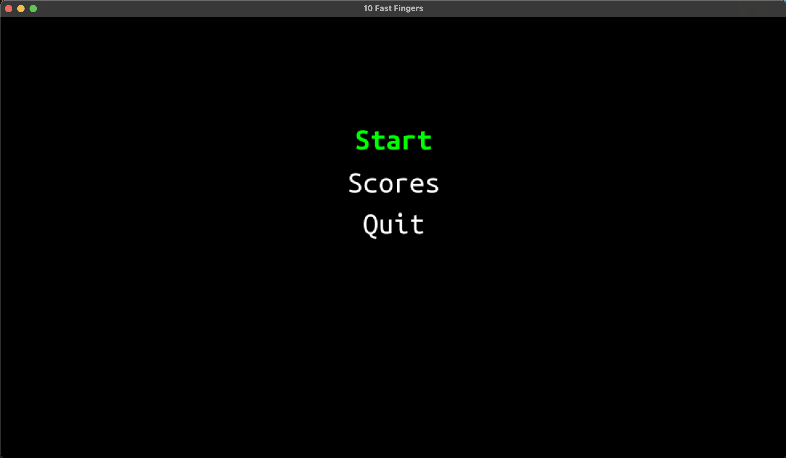
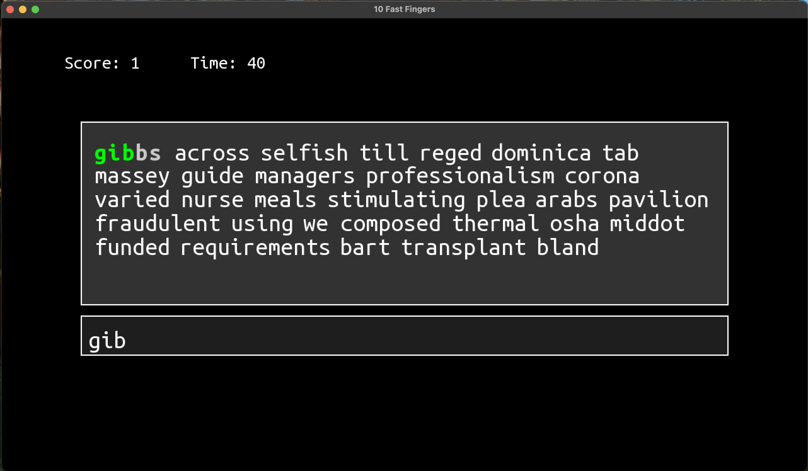
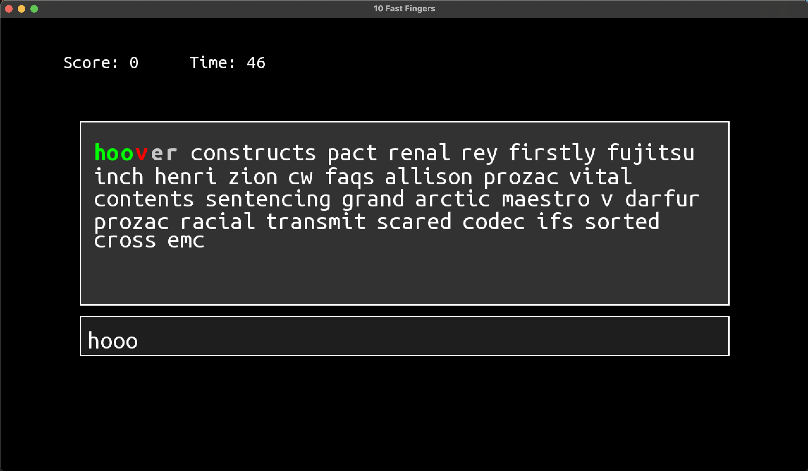

# SFML Project

Small C++ game using [SFML 3.0](https://www.sfml-dev.org/).
(Copy of this [game](https://10fastfingers.com/typing-test/english))

## Build

Using CMake, it should work on `Linux`, `MacOS`, `Windows` !

```sh
mkdir build; cd build;
cmake ..; cd ..;
cmake --build build;

./build/bin/main
```

## Screenshots



